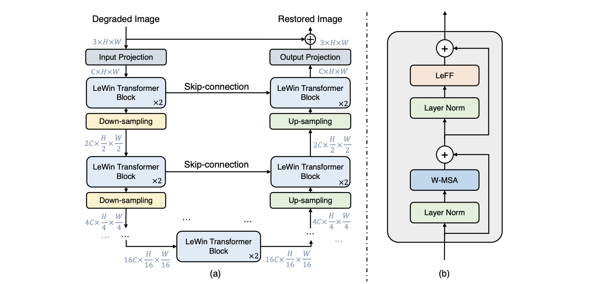

# Uformer
### _A General U-Shaped Transformer for Image Restoration_

This notebook presents the architecture and application of the Uformer neural network, presented in. It consists of a Transformer-based encoder-decoder structure. The innovations introduced in this architecture are:

- A nonoverlapping window-based self-attention instead of global self-attention
- A learnable multi-scale restoration modulator in the form of a multi-scale spatial bias to adjust features in multiple layers
 

The Uformer network is used for the application purpose of image restoration. In particular, it is applied to two specific tasks:

- Denoising: image noise removal
- Deblurring: removal of image blurring

Our project will focus on the first task, denoising, which in Uformer's paper is performed on the two benchmarks: the Smartphone Image Denoising Dataset (SIDD) and the Darmstadt Noise Dataset (DND).

The evaluation measures on which the performance of the denoising process is evaluated are the structural similarity index measure (SSIM) and the peak signal-to-noise ratio (PSNR).

In conclusion, our project aims to repurpose the working Uformer architecture for the denoising task, without constraints on achieving the same evaluation metrics as the state-of-the-art.

# Preliminaries
All the project is embedded in the notebook _Uformer_, in the directory _code_. Some important steps, before running the program, are the following:

- Download the SSID dataset from [SSID_dataset](https://www.eecs.yorku.ca/~kamel/sidd/)
- Place the downloaded dataset in the directory _dataset_
- Rename its directory with "_Full_SSID_dataset_" if you downloaded the full one, or "_SSID_dataset_". 
- Open the notebook and **modify the path in section _Global_ to access the dataset**.

# Datasets
The above dataset directories are already present but not with all the samples concerning the real datasets. 

This is to allow the user to test the whole notebook, but he has to keep in mind that the results may not be good without the full/half dataset.

Moreover, there is a directory "_Try_SSID_dataset_" that is used in the notebook to show some samples during the composition of the dataset.

Considering all this files, the project has a size of almost 3GB of memory. The project can reach up to 12GB if the complete SSID dataset is downloaded.
 
# Dependencies
All the packages required for the project are automatically installed when the notebook is run.

# Run test
All the necessary things, other than dataset and paths, are already present in the notebook.

Test the program is very easy: it is required to run sequentially all the cells of the notebook. 
The only errors that may occour are relative to wrong/mispelled paths.

The first cell of _Global_, the one relating to the connection to Google Drive, must only be executed if the notebook is run on Google Colab.
 
**ATTENTION: There may be some problems displaying mathematical formulas when opening the notebook on GitLab. Therefore, it is recommended to download the repository**
